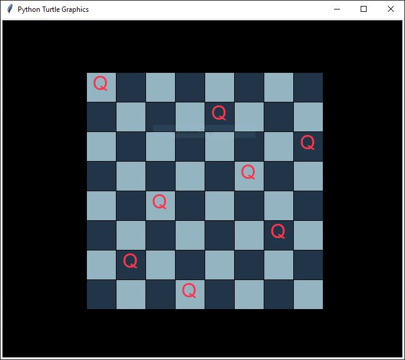

# N-Queens-Chessboard-Visualization

This Python program solves the N-Queens problem using a backtracking algorithm and visually displays the solution using the `turtle` graphics library. It draws a chessboard and places the queens on the board, ensuring that no queens threaten each other. The program is designed to show the process step-by-step, with an animation of placing each queen.

## Features
- **Visual Chessboard**: Draws a chessboard with alternating light and dark squares.
- **N-Queens Solver**: Uses a backtracking algorithm to solve the N-Queens problem.
- **Step-by-Step Animation**: Places queens one by one on the board and shows the solution with a short delay between each placement.
- **Customizable Board Size**: You can change the board size to solve the N-Queens problem for any valid size (e.g., 4, 6, 8, etc.).

## Example Chessboard

Here’s a screenshot of what the chessboard looks like when the program runs:



## Installation

### Prerequisites
- Python 3.x
- `turtle` graphics library (comes pre-installed with Python).

### Steps to Install
1. **Clone the Repository**  
   Clone this repository to your local machine using the following command:
   ```bash
   git clone https://github.com/your-username/nqueens-chessboard.git
